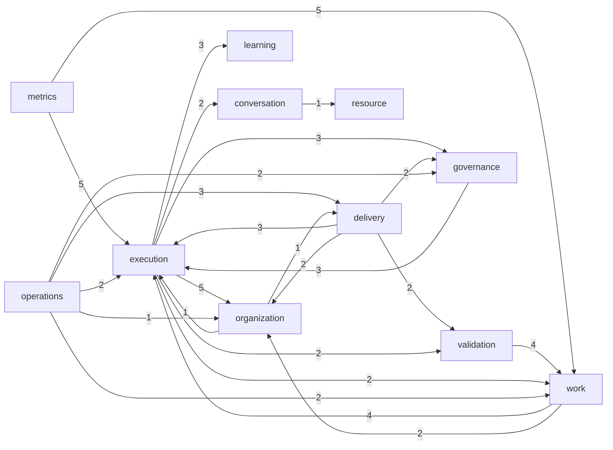

# 跨域依赖与断环方案（R3）

> 只读分析，**没有动任何代码** ✗。数据来自架构守卫 `scripts/check_architecture.py` 的
> `modules()` + `_layer_edges()`（**同一份**模块与边，不另取参照 ✓）。
> 这份文件由 `scripts/analyze_cross_domain.py` 生成，可重跑 ✓。

## 一、总览

- 跨域依赖边：**62** 条（R3 报的就是这些）
- 涉及域：**11** 个
- **成环的域对：1 对**（A→B 且 B→A）

## 二、域间依赖图（mermaid）

## 三、边数排行（谁依赖别人最多）

| 从 | 到 | 边数 | 其中「像契约」的 | 例子（前 2 条） |
|---|---|---|---|---|
| execution | organization | 5 | 0 | `ai_factory_os.services.organization.store` · `ai_factory_os.services.organization.identity` |
| metrics | execution | 5 | 2 | `ai_factory_os.services.execution.runtime.types` · `ai_factory_os.services.execution.runtime.store` |
| metrics | work | 5 | 2 | `ai_factory_os.services.work.types` · `ai_factory_os.services.work.store` |
| validation | work | 4 | 2 | `ai_factory_os.services.work.types` · `ai_factory_os.services.work.store` |
| work | execution | 4 | 1 | `ai_factory_os.services.execution.runtime.store` · `ai_factory_os.services.execution.runtime.registry` |
| delivery | execution | 3 | 0 | `ai_factory_os.services.execution.rules` · `ai_factory_os.services.execution.production_run` |
| execution | governance | 3 | 0 | `ai_factory_os.services.governance` · `ai_factory_os.services.governance.service` |
| execution | learning | 3 | 1 | `ai_factory_os.services.learning.experience` · `ai_factory_os.services.learning.store` |
| governance | execution | 3 | 0 | `ai_factory_os.services.execution.production_run` · `ai_factory_os.services.execution.production_run` |
| operations | delivery | 3 | 0 | `ai_factory_os.services.delivery.release_service` · `ai_factory_os.services.delivery.release_service` |
| delivery | governance | 2 | 0 | `ai_factory_os.services.governance.gates` · `ai_factory_os.services.governance.store` |
| delivery | organization | 2 | 0 | `ai_factory_os.services.organization.artifact_lifecycle` · `ai_factory_os.services.organization.artifact_lifecycle` |
| delivery | validation | 2 | 0 | `ai_factory_os.services.validation.verification` · `ai_factory_os.services.validation.retry_policy` |
| execution | conversation | 2 | 0 | `ai_factory_os.services.conversation.handoff` · `ai_factory_os.services.conversation.project_memory` |
| execution | validation | 2 | 0 | `ai_factory_os.services.validation.verification_store` · `ai_factory_os.services.validation.evidence_store` |
| execution | work | 2 | 0 | `ai_factory_os.services.work.store` · `ai_factory_os.services.work.store` |
| operations | work | 2 | 0 | `ai_factory_os.services.work` · `ai_factory_os.services.work` |
| operations | execution | 2 | 0 | `ai_factory_os.services.execution.runtime.store` · `ai_factory_os.services.execution.production_run` |
| operations | governance | 2 | 0 | `ai_factory_os.services.governance.gates` · `ai_factory_os.services.governance.store` |
| work | organization | 2 | 0 | `ai_factory_os.services.organization.projects` · `ai_factory_os.services.organization.projects` |
| conversation | resource | 1 | 0 | `ai_factory_os.services.resource.rules` |
| operations | organization | 1 | 0 | `ai_factory_os.services.organization.artifact_lifecycle` |
| organization | delivery | 1 | 0 | `ai_factory_os.services.delivery.ops` |
| organization | execution | 1 | 0 | `ai_factory_os.services.execution.kernel.store` |

## 四、成环情况（要断的）

- **真环（强连通分量, 绕得回来）：1 个**
  - delivery, execution, governance, organization, validation, work
- **直接双向（A⇄B 两边都有边）：8 对** —— 这种最好断 ✓

### delivery ⇄ organization（2 + 1 条）

- `delivery → organization`：2 条，其中像契约的 0 条
- `organization → delivery`：1 条，其中像契约的 0 条
- 例子：`services/delivery/release_service.py:212 → ai_factory_os.services.organization.artifact_lifecycle` ／ `services/organization/artifact_lifecycle.py:439 → ai_factory_os.services.delivery.ops`

### execution ⇄ governance（3 + 3 条）

- `execution → governance`：3 条，其中像契约的 0 条
- `governance → execution`：3 条，其中像契约的 0 条
- 例子：`services/execution/kernel/cli.py:51 → ai_factory_os.services.governance` ／ `services/governance/gates.py:63 → ai_factory_os.services.execution.production_run`

### execution ⇄ organization（5 + 1 条）

- `execution → organization`：5 条，其中像契约的 0 条
- `organization → execution`：1 条，其中像契约的 0 条
- 例子：`services/execution/kernel/cli.py:204 → ai_factory_os.services.organization.store` ／ `services/organization/artifact_lifecycle.py:140 → ai_factory_os.services.execution.kernel.store`

### execution ⇄ work（2 + 4 条）

- `execution → work`：2 条，其中像契约的 0 条
- `work → execution`：4 条，其中像契约的 1 条
- 例子：`services/execution/orchestration/pipeline.py:30 → ai_factory_os.services.work.store` ／ `services/work/assignment/allocator.py:31 → ai_factory_os.services.execution.runtime.store`

## 五、断法（三选一, 按代价从低到高）

| 断法 | 适用 | 代价 | 风险 |
|---|---|---|---|
| **搬类型**：把纯类型/枚举/契约搬到 `contracts/<域>/` | 边是「像契约」的那类（本报告第 3 列） | 低（同 R4/R9 的做法 ✓） | 低（保留再导出或改调用方 ✓） |
| **注入**：调用方把需要的行为作为参数传进来 | 边是「要执行/查询」的那类 | 中（改函数签名 + 调用点） | 中（要跑全链回归 ✓） |
| **改归属**：把模块搬到真正该在的域 | 两边互相纠缠、搬类型也断不干净 | 高 | 高（动 import 图） |

## 六、建议顺序（我的判断, 供你裁决）

1. 先做**不成环**的跨域边：把其中「像契约」的搬进 `contracts/` ⇒ 边数大降、风险最低
2. 再针对**成环**的（上面第三节）逐对处理：先把两个方向里「像契约」的一半搬走，
   环往往自己就断了 ✓；剩下的真行为依赖再谈注入
3. 一次只动一对域，每步全量 `pytest` + 架构守卫复核（同 R9/R10 的做法 ✓）

> 每步都要能回答：「这条边断了以后，行为一字未变吗？」 ✗ 变了就不是重构, 是改功能。

## 七、结论（我的判断, 供你裁决）

1. **真环只有 1 个**, 但它把 **6 个域**圈在一起：`delivery · execution · governance · organization · validation · work`
   —— 这 6 个是平台的**核心耦合**, 动一个都容易牵扯其余 ⇒ 不建议随手切 ✗
2. **直接双向 8 对**（A⇄B 两边都有边）⇒ 这类最好断：通常**一边只有 1–3 条边** ✓
   把那条边反过来（改调用方 / 注入）就能拆掉一对 ✓
3. 关键数字：**像契约的只占 12%**（8/62）✗ ⇒ 88% 是真行为依赖 ⇒
   **R3 不能靠"搬类型"了事** ✗（R4/R9 那套招数在这里不够用）
4. 因此建议：**先挑"直接双向里最薄的一对"做试点**（例如 `organization → delivery` 只有 1 条边）
   ⇒ 验证"断一条边, 行为一字未变"的方法论 ✓ 再谈剩下 7 对 ✓
5. 那个 6 域大环 ⇒ **单独一次设计**, 不要和别的改动混在一起 ✗
